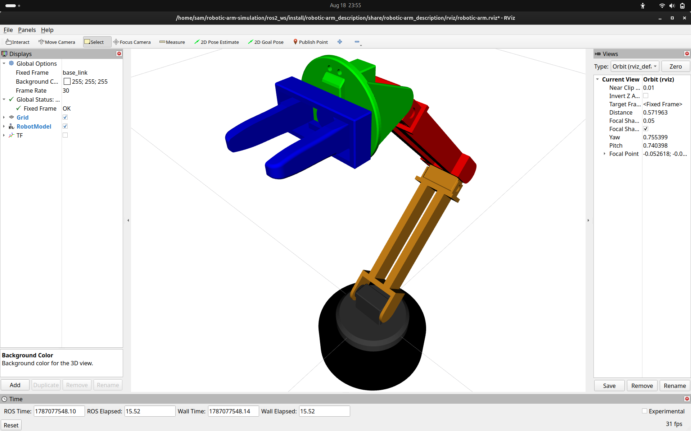
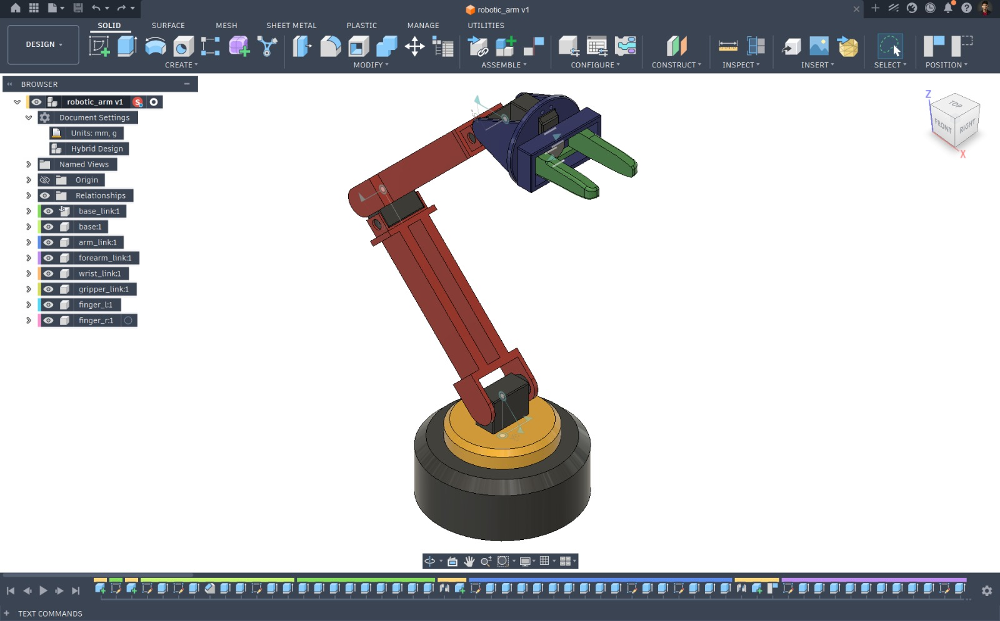

<div align="center">

# 🤖 ROS 2 Robotic Arm Simulation

A complete **robotic arm simulation and motion planning project** built using **ROS 2**, **RViz2**, and **MoveIt 2**, featuring robot modeling, joint control, motion planning, collision checking, and gripper simulation.

---

### 🎥 Project Demonstration

<a href="resources/videos/robotic_arm_sim.mp4">
  
</a>

Click the gif above to watch the complete robotic arm simulation and motion planning demonstration.

</div>

---

# 📖 Overview

This project demonstrates the complete workflow of building and simulating a **robotic manipulator using ROS 2 and MoveIt 2**.

The robotic arm has been modeled using **URDF/Xacro**, with CAD-generated mesh geometry, inertial properties, collision geometry, and a multi-joint kinematic structure.

The project provides a foundation for experimenting with modern robotic manipulation concepts including:

* Robot Modeling
* URDF / Xacro
* Forward Kinematics
* Inverse Kinematics
* Motion Planning
* Collision Detection
* Joint State Visualization
* MoveIt 2
* RViz2
* Robot Manipulation
* Gripper Control

The project is intended to serve as a foundation for further development toward **real robotic arm control and advanced manipulation research**.

---

# 🤖 Robot Features

<div align="center">

| RViz2                                      | MoveIt 2                               |
| ------------------------------------------ | -------------------------------------- |
|  |  |

</div>

### Robot Configuration

The simulated robotic arm consists of:

* `base_footprint`
* `base_link`
* Rotating Base
* `arm_link`
* `forearm_link`
* `wrist_link`
* `gripper_link`
* Left Gripper Finger
* Right Gripper Finger

### Joint Configuration

The arm contains:

* Continuous base rotation
* Continuous arm rotation
* Continuous forearm rotation
* Continuous wrist rotation
* Fixed wrist-to-gripper connection
* Two prismatic gripper joints

---

# 🧱 Robot Model

The robot geometry is generated from CAD models and imported into ROS 2 using STL meshes.

<div align="center">



</div>

### Robot Links

```text
base_footprint
└── base_link
    └── base
        └── arm_link
            └── forearm_link
                └── wrist_link
                    └── gripper_link
                        ├── finger_l
                        └── finger_r
```

The robot description contains both **visual** and **collision** geometry for the individual links.

---

# ⚙️ Robot Parameters

| Component       | Parameter                   |
| --------------- | --------------------------- |
| Robot Type      | Robotic Manipulator         |
| Description     | URDF / Xacro                |
| Visualization   | RViz2                       |
| Motion Planning | MoveIt 2                    |
| Simulation      | ROS 2 compatible simulation |
| Base Joint      | Continuous                  |
| Arm Joint       | Continuous                  |
| Forearm Joint   | Continuous                  |
| Wrist Joint     | Continuous                  |
| Gripper         | Parallel Prismatic Gripper  |
| Mesh Format     | STL                         |
| Mesh Scale      | `0.001 0.001 0.001`         |
| Robot Mass      | ≈ 2.90 kg                   |

---

# 🦾 MoveIt 2

The robotic arm is configured with **MoveIt 2** for motion planning and manipulation.

MoveIt 2 provides the planning framework required to calculate collision-free trajectories between different robot configurations.

### MoveIt 2 Features

* Motion Planning
* Joint-Space Planning
* Pose-Based Planning
* Collision Checking
* Planning Scene
* Robot State Visualization
* Joint State Control
* End-Effector Targeting
* Trajectory Generation

<div align="center">


</div>

---

# 🎯 Motion Planning

The robot can be commanded through MoveIt 2 by specifying target joint configurations or end-effector poses.

### Planning Pipeline

```text
Target Pose
     ↓
Inverse Kinematics
     ↓
Motion Planning
     ↓
Collision Checking
     ↓
Trajectory Generation
     ↓
Robot Execution
```

<div align="center">


</div>

---

# 🧭 RViz2 Visualization

RViz2 is used as the primary interface for visualizing the robot model and MoveIt 2 planning environment.

It provides visualization of:

* Robot Model
* TF Frames
* Joint States
* Planning Groups
* End Effector
* Collision Geometry
* Planned Trajectories
* Planning Scene

<div align="center">


</div>

---

# ✋ Gripper

The robotic arm includes a parallel gripper consisting of:

```text
gripper_link
├── finger_l
└── finger_r
```

The fingers are modeled using prismatic joints and are intended to provide basic grasping functionality.

<div align="center">


</div>

---

# 🧩 Collision Detection

Collision geometry is defined independently from the visual geometry.

This allows MoveIt 2 to determine whether a planned trajectory causes the robot to collide with:

* Itself
* Other robot links
* Objects in the planning scene
* Environmental obstacles

<div align="center">


</div>

---

# 🌍 Planning Scene

MoveIt 2 allows objects to be added to the planning scene to test manipulation and obstacle avoidance.

Example workflow:

```text
Robot
   +
Planning Scene
   ↓
Collision Detection
   ↓
Motion Planner
   ↓
Collision-Free Trajectory
```

<div align="center">


</div>

---

# ⚙️ Requirements

* ROS 2 Jazzy
* MoveIt 2
* RViz2
* Xacro
* URDF
* Python 3
* colcon

---

# ▶️ Getting Started

### Clone Repository

```bash
git clone <repository-url>
```

### Enter Workspace

```bash
cd robotic-arm-simulation/ros2_ws
```

### Build

```bash
colcon build --symlink-install
```

### Source Workspace

```bash
source install/setup.bash
```

---

# 🚀 Launch Robot Description

Launch the robotic arm visualization:

```bash
ros2 launch robotic-arm_description display.launch.py
```

This launches the robot description and RViz2 visualization.

---

# 🦾 Launch MoveIt 2

After building and sourcing the workspace, launch the MoveIt 2 configuration:

```bash
ros2 launch robotic-arm_moveit demo.launch.py
```

This starts the MoveIt 2 planning environment and RViz2 interface.

---

# 🎯 MoveIt 2 Workflow

The general workflow of the project is:

```text
URDF / Xacro
      ↓
Robot Description
      ↓
MoveIt 2 Configuration
      ↓
Kinematic Model
      ↓
Planning Group
      ↓
RViz2
      ↓
Target Pose
      ↓
Motion Planning
      ↓
Trajectory
      ↓
Robot
```

---

# 📁 Repository Structure

```text
ros2_ws/
├── robotic-arm_description/
│   ├── meshes/
│   ├── urdf/
│   ├── launch/
│   ├── rviz/
│   └── world/
│
├── robotic-arm_moveit/
│   ├── config/
│   ├── launch/
│   ├── srdf/
│   └── ...
│
└── ...
```
---

# ✅ Current Capabilities

* ✔️ Robotic Arm URDF
* ✔️ Xacro Robot Description
* ✔️ CAD-Based STL Meshes
* ✔️ Visual Geometry
* ✔️ Collision Geometry
* ✔️ Inertial Properties
* ✔️ Multi-Joint Manipulator
* ✔️ Parallel Gripper
* ✔️ RViz2 Visualization
* ✔️ MoveIt 2 Configuration
* ✔️ Motion Planning
* ✔️ Collision Checking
* ✔️ Planning Scene
* ✔️ Joint-Space Planning
* ✔️ End-Effector Planning

<div align="center">

| MoveIt 2 Planning                          | Robotic Arm                                      |
| ------------------------------------------ | ------------------------------------------------ |
|  |  |

</div>

---

# 🎯 Future Improvements

* Realistic Gripper Joint Limits
* Gazebo Simulation Integration
* `ros2_control` Integration
* Joint Trajectory Controllers
* Improved Inverse Kinematics
* Object Grasping
* Pick-and-Place Tasks
* Advanced Collision Objects
* Computer Vision Integration
* Camera-Based Manipulation
* Real Robot Deployment
* Sim-to-Real Transfer

---

# 🤖 Research Applications

This project provides a foundation for research and development in:

* Robotic Manipulation
* Motion Planning
* Inverse Kinematics
* Robot Dynamics
* Grasp Planning
* Human-Robot Interaction
* Computer Vision-Based Manipulation
* Sim-to-Real Robotics

The same **CAD → URDF → MoveIt 2 → Simulation → Control → Hardware** workflow can be extended toward more advanced robotic systems, including **humanoid and bionic manipulation platforms**.

---

# 🤝 Contributions

Contributions, suggestions, and feature requests are always welcome.

If you find this project useful, consider giving it a ⭐ on GitHub.

---

<div align="center">

Built with ❤️ using **ROS 2 & MoveIt 2**

</div>
